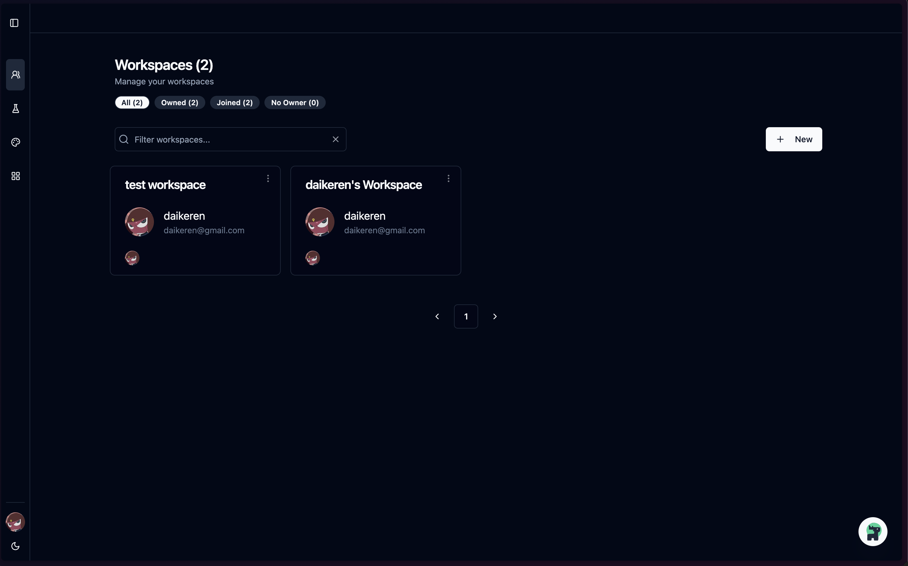
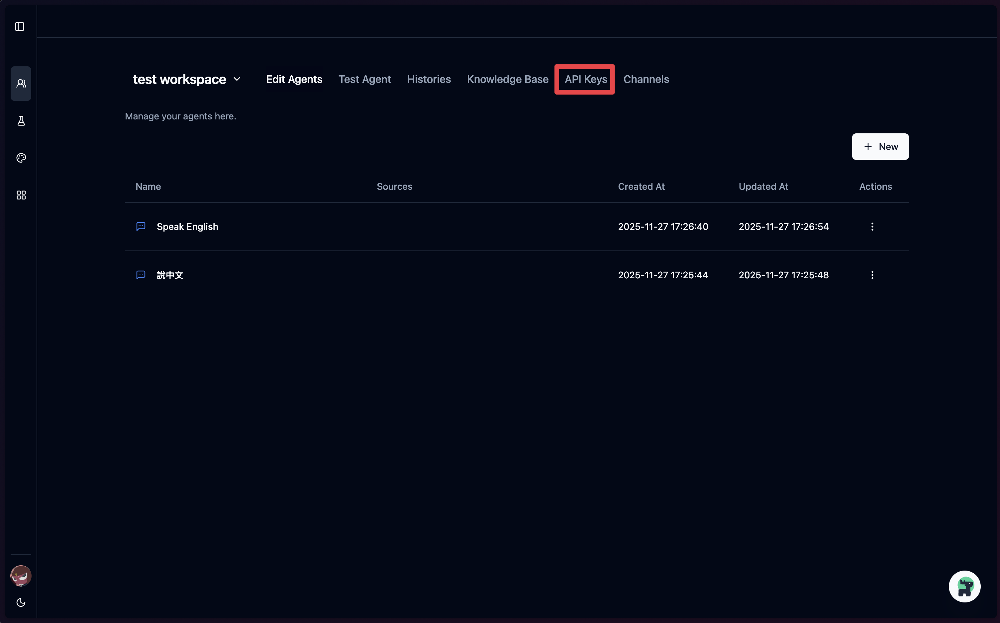
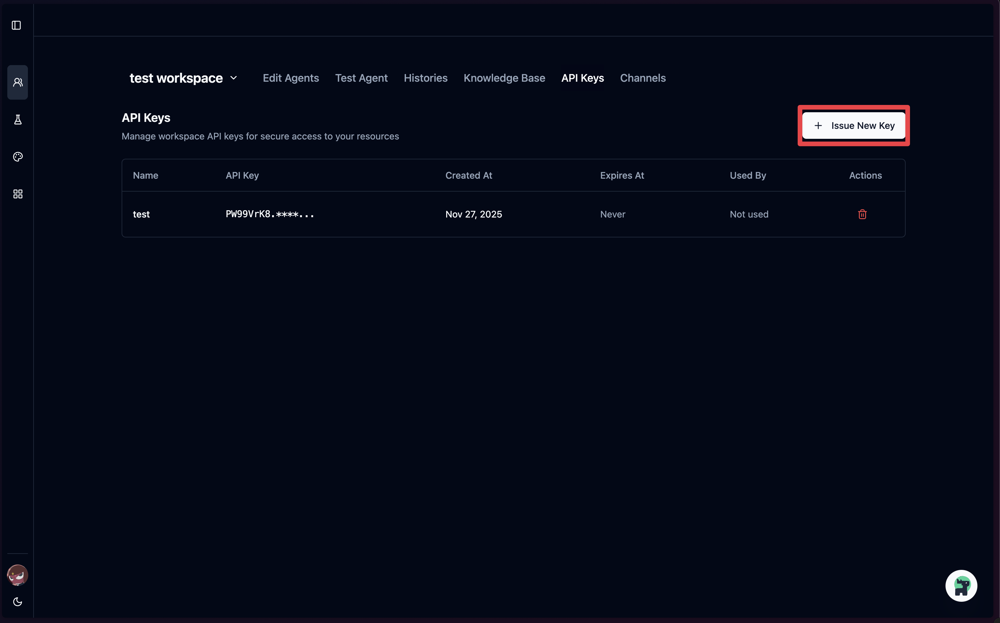
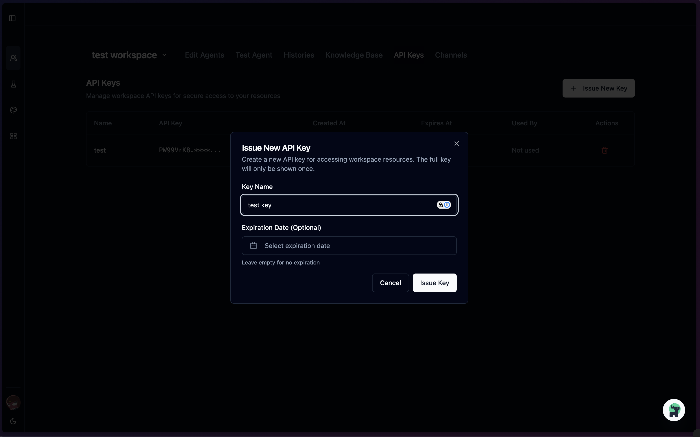
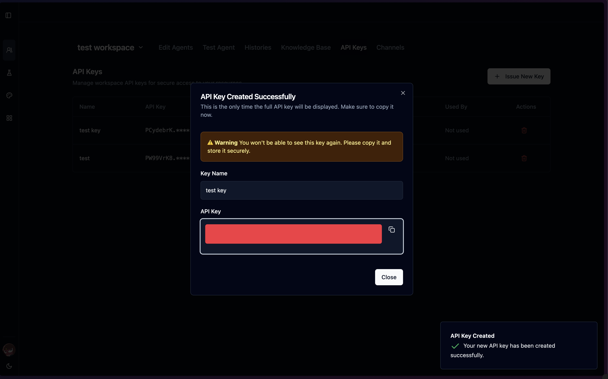

# How to Get Your API Key

This guide walks you through the process of obtaining an API key from the Codeer platform.

## Step 1: Select a Workspace

After logging in, you'll see the **Workspaces** page. Select the workspace where you want to create an API key.

## Step 2: Navigate to API Keys

Once inside your workspace, click on the **API Keys** tab in the navigation menu.

## Step 3: Click "Issue New Key"

On the API Keys page, click the **+ Issue New Key** button in the top right corner.

## Step 4: Configure Your API Key

In the dialog that appears:

1. Enter a **Key Name** to identify this API key
2. Optionally set an **Expiration Date** (leave empty for no expiration)
3. Click **Issue Key** to create the key

## Step 5: Copy Your API Key

Your API key has been created successfully. **Important:** This is the only time the full API key will be displayed.

1. Click the copy button next to the API key to copy it to your clipboard
2. Store it securely - you won't be able to see the full key again

> **Warning:** You won't be able to see this key again. Please copy it and store it securely.

## Next Steps

Use your API key to authenticate requests to the Codeer API. See the [README](README.md) for example implementations.
